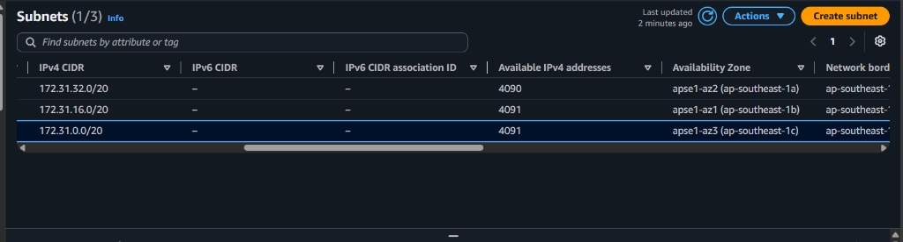
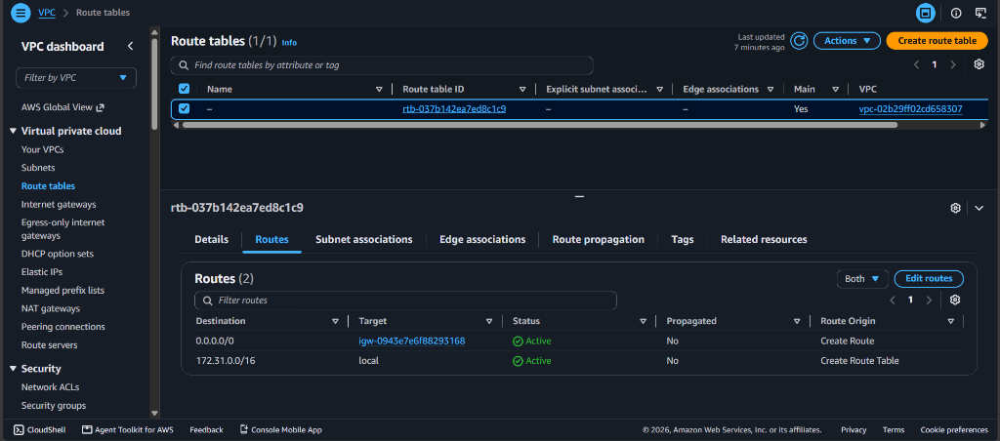
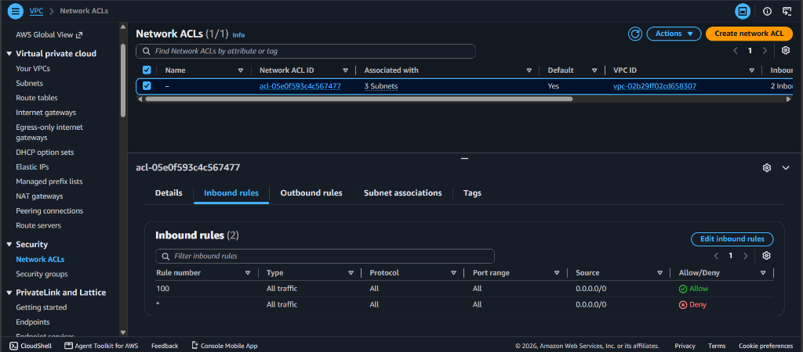
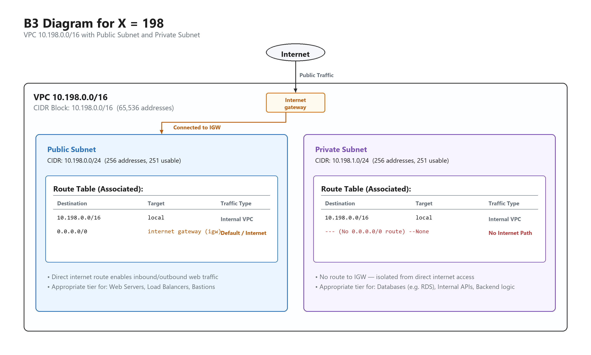

# Assignment 2 Submission

<!--
How to use this template:

1. Copy this file to submissions/assignment-2/<your-github-username>/submission.md
2. Replace every answer placeholder with your own answer. Delete the angle brackets too.
3. Save your four images in the same folder, with the exact file names below.
4. Do not write your full name or your student number in this file.
-->

## About me

- GitHub username: CPCNarido
- Section: IV-DCSAD
- IAM user name that I signed in with: `dcsad-g07`
- X: 198

---

## Part A. Explore

### A1. The VPC

Default VPC IPv4 CIDR:

`172.31.0.0/16`

Number of addresses in that CIDR:

65,536

### A2. The subnets

| Availability Zone | IPv4 CIDR |
| --- | --- |
| `ap-southeast-1a` | `172.31.32.0/20` |
| `ap-southeast-1b` | `172.31.16.0/20` |
| `ap-southeast-1c` | `172.31.0.0/20` |

Screenshot 1. Save it as `screenshot-1-subnets.png` in your folder. The image line below shows it.

### A3. Available addresses

Available IPv4 addresses in each subnet:

- `ap-southeast-1a`: 4,090
- `ap-southeast-1b`: 4,091
- `ap-southeast-1c`: 4,091

Why is the number lower than 4,096?

A `/20` block has 4,096 total addresses. AWS automatically reserves 5 addresses in every subnet (the network address, VPC router, DNS resolver, AWS future use, and network broadcast). Therefore, an empty subnet has 4,096 − 5 = 4,091 available addresses.

What uses the missing address in the subnet with the lowest number?

`ap-southeast-1a` has 4,090 available addresses, which is 1 address fewer than the others. An active network interface (such as one belonging to an EC2 instance launched in that subnet) is holding that missing IP address.

### A4. The route table

| Destination | Target |
| --- | --- |
| `172.31.0.0/16` | `local` |
| `0.0.0.0/0` | `igw-0943e7e6f88293168` |

Screenshot 2. Save it as `screenshot-2-routes.png` in your folder. The image line below shows it.

### A5. Public or private

Are the default subnets public or private? Which route proves it?

Public. The route `0.0.0.0/0` pointing to the internet gateway (`igw-0943e7e6f88293168`) proves that these subnets are public.

### A6. The internet gateway

State of the internet gateway:

Attached

What happens to the default subnets if the gateway is detached?

The route `0.0.0.0/0` will lose its active target, cutting off direct internet connectivity for all instances in those subnets. Instances in the VPC can still communicate with each other locally via the `local` route.

### A7. NAT gateways

Number of NAT gateways:

0

Can a server in a new private subnet download updates? Why?

No. A private subnet has no route to an internet gateway. To allow outbound internet access for updates while preventing inbound connections, it requires a NAT gateway in a public subnet and a route pointing `0.0.0.0/0` to that NAT gateway. Since there are 0 NAT gateways in the VPC, the server cannot reach the internet to download updates.

### A8. The network ACL

| Rule number | Source | Allow or Deny |
| --- | --- | --- |
| 100 | `0.0.0.0/0` | Allow |
| `*` | `0.0.0.0/0` | Deny |

How is a network ACL different from a security group?

A network ACL is a stateless firewall applied at the subnet level that evaluates ordered rules (lowest rule number first) and supports both Allow and Deny rules. A security group is a stateful firewall applied at the resource/instance level that contains only Allow rules and automatically allows return traffic.

Screenshot 3. Save it as `screenshot-3-network-acl.png` in your folder. The image line below shows it.

### A9. The default security group

Inbound rule (type and source):

All traffic, from `sg-...` (the default security group itself).

Which resources can send traffic to an instance that uses it?

Only resources that are also assigned to the `default` security group. Because there are no other inbound rules, traffic from all other sources is blocked.

---

## Part B. Prepare

### B1. Plan two subnets

- Public subnet CIDR: `10.198.0.0/24`
- Private subnet CIDR: `10.198.1.0/24`

### B2. Route tables

Route table of the public subnet:

| Destination | Target |
| --- | --- |
| `10.198.0.0/16` | `local` |
| `0.0.0.0/0` | `internet gateway` |

Route table of the private subnet:

| Destination | Target |
| --- | --- |
| `10.198.0.0/16` | `local` |

### B3. My VPC diagram

Tool used (Excalidraw, draw.io, Lucidchart, or paper):

Excalidraw

Save your diagram as `vpc-diagram.png` in your folder. The image line below shows it.

### B4. Predict a change

Can you still open the web page from your laptop? Why?

No. The laptop connects over the public internet. Without the `0.0.0.0/0` route pointing to the internet gateway, outbound response traffic cannot find a path back to the laptop, even if the EC2 instance has a public IP address assigned.

Can the instance still reach another instance in the VPC? Why?

Yes. The local route `172.31.0.0/16` remains active in the route table, allowing instances in the VPC to communicate directly with each other across subnets.

### B5. Place a database

Which subnet gets the database? Why?

The private subnet, `10.198.1.0/24`. A database stores sensitive application data and should not be directly exposed to the public internet. Placing it in the private subnet ensures it has no internet gateway route, keeping it protected while allowing web servers in the public subnet to connect to it locally.

### B6. My question about VPCs

What is your question, and what made you think of it?

Can two separate VPCs in different AWS Regions communicate directly with each other without routing through the public internet, and does AWS charge data transfer fees for that traffic? I thought of this because modern production systems often deploy across multiple regions for high availability and disaster recovery.
